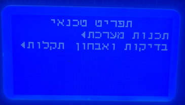
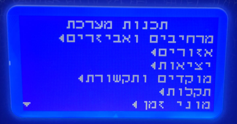
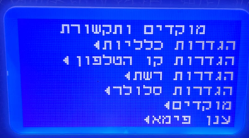
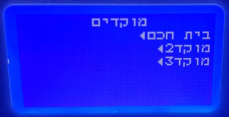
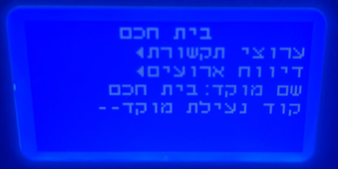
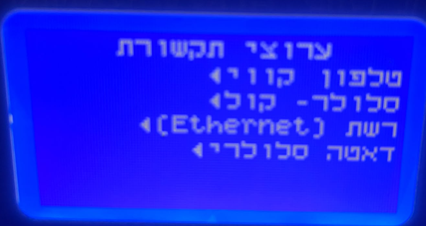
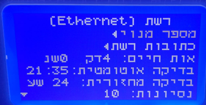
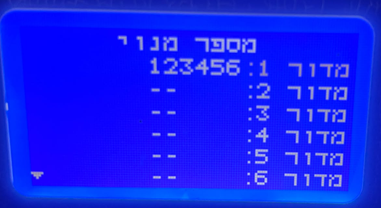
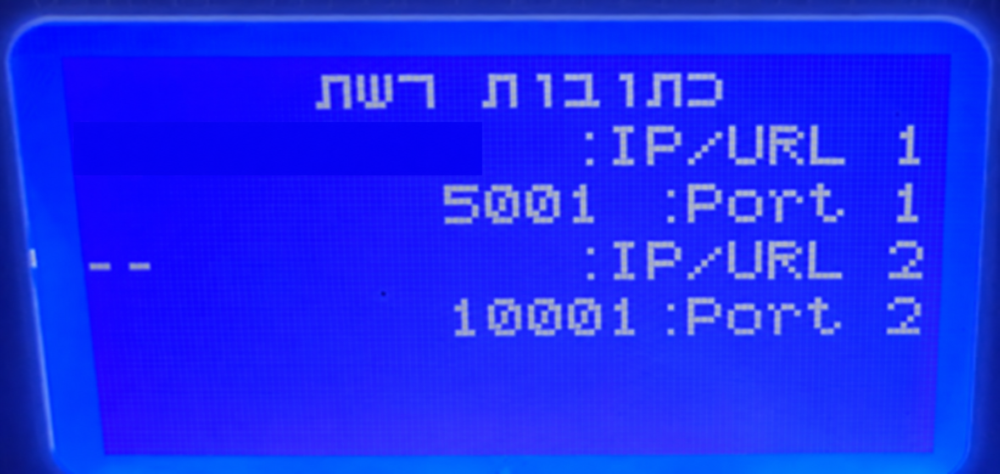
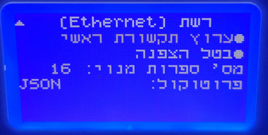

# הגדרת מערכת PIMA FORCE לחיבור ל Home Assistant

מדריך זה מסביר כיצד להגדיר במערכת PIMA FORCE מוקד בית חכם המתחבר אל Home Assistant באמצעות פרוטוקול JSON על גבי TCP ברשת המקומית.

**חשוב:** ההגדרה מחייבת קוד טכנאי. אין לשנות מוקד פעיל המשמש חברת שמירה. בחר מוקד פנוי או בצע את השינוי בעזרת מתקין מוסמך.

אפשר גם [להוריד את גרסת Word של המדריך](PANEL_SETUP_HE.docx).

## לפני שמתחילים

1. התקן והגדר את האינטגרציה PIMA Force ב Home Assistant.
2. הקצה לשרת Home Assistant כתובת IP קבועה או שמירת DHCP קבועה בנתב.
3. רשום את מספר המנוי ואת פורט ה TCP שתזין גם במערכת PIMA וגם באינטגרציה.
4. ודא שהפורט שנבחר אינו בשימוש ושחומת האש מאפשרת למערכת PIMA להגיע אליו.

## הגדרת המוקד במערכת PIMA

### שלב 1  כניסה לתפריט הטכנאי

היכנס למערכת באמצעות קוד הטכנאי. לאחר הזנת הקוד יוצג תפריט הטכנאי הראשי.

### שלב 2  פתיחת תכנות המערכת

בתפריט הטכנאי בחר **תכנות מערכת**.

### שלב 3  פתיחת מוקדים ותקשורת

בתפריט תכנות מערכת בחר **מוקדים ותקשורת**.

### שלב 4  בחירת מוקדים

בחר **מוקדים** כדי להציג את המוקדים המוגדרים במערכת.

### שלב 5  בחירת מוקד פנוי

בחר מוקד שאינו משמש חברת שמירה, בדרך כלל מוקד 2 או מוקד 3. אפשר לשנות את שם המוקד ל **בית חכם** באמצעות האפשרות **שם מוקד**. בתמונה מוצג מוקד שכבר נקרא בית חכם.

> **אזהרה:** אל תבחר מוקד פעיל לפני שווידאת שאינו משמש לדיווח לחברת שמירה.

### שלב 6  פתיחת ערוצי התקשורת

בתפריט המוקד שבחרת פתח **ערוצי תקשורת**.

### שלב 7  בחירת רשת Ethernet והגדרת אות החיים

בחר **רשת Ethernet**. החיבור אל Home Assistant מתבצע מהרשת המקומית באמצעות TCP.

ההגדרה **אות חיים** קובעת באיזו תדירות המערכת שולחת הודעת keepalive גם כאשר אין אירוע חדש. במסך המצולם מוגדר מרווח של 4 דקות. האינטגרציה משתמשת באות החיים כדי לוודא שהחיבור פעיל, ולכן מומלץ להשאיר ערך זה ללא שינוי. אם לא מתקבלת שום תעבורה במשך 12 דקות, האינטגרציה מסמנת את החיבור כמנותק וסוגרת אותו כדי לאפשר למערכת להתחבר מחדש.

### שלב 8  הגדרת מספר המנוי

פתח **מספר מנוי**, בחר מדור 1 והזן מספר בן שש ספרות. הזן בדיוק את אותו מספר בשדה **Account** באינטגרציה של Home Assistant.

### שלב 9  הגדרת כתובת הרשת והפורט

חזור למסך רשת ופתח **כתובות רשת**. בשורה **IP/URL 1** הזן את כתובת ה IP הקבועה של שרת Home Assistant. בשורה **Port 1** הזן את פורט ה TCP שהוגדר באינטגרציה. אין צורך למלא את **IP/URL 2** ואת **Port 2**.

> **התאמה נדרשת:** מספר המנוי והפורט במערכת PIMA חייבים להיות זהים לערכים שהוגדרו באינטגרציה. ברירת המחדל של האינטגרציה היא פורט `10006`, אך אפשר להשתמש בפורט אחר אם הוא זהה בשני הצדדים.

### שלב 10  בחירת פרוטוקול JSON

חזור למסך רשת ועבור למסך השני. ודא ש **ערוץ תקשורת ראשי** מסומן, בטל את ההצפנה ובחר **JSON** בשדה **פרוטוקול**.

## שמירה והפעלת החיבור

צא מתפריט הטכנאי ושמור את השינויים. המערכת תאתחל את עצמה ותנסה לפתוח חיבור אל Home Assistant.

מערכת PIMA היא שיוזמת את חיבור ה TCP. לכן אין להזין את כתובת ה IP של מערכת האזעקה באינטגרציה.

## בדיקת החיבור ב Home Assistant

1. פתח **הגדרות ← מכשירים ושירותים ← PIMA Force**.
2. ודא שהישות **Panel connection** מציגה מצב מחובר.
3. ודא שאזורי האזעקה ושמות האזורים מופיעים.
4. פתח וסגור אזור ובדוק שמצב הישות מתעדכן.
5. בדוק דריכה ונטרול רק כאשר בטוח להפעיל את מערכת האזעקה.

## פתרון תקלות

- **אין חיבור:** בדוק שוב את כתובת ה IP של Home Assistant, מספר המנוי והפורט.
- **יש חיבור אך אין אירועי אזורים:** בדוק בהגדרות דיווח אירועים של המוקד שהדיווח על אזורים מופעל.
- **פקודות נדחות:** בדוק את קוד המשתמש שהוגדר באינטגרציה ואת ההרשאות שלו.
- **החיבור מתנתק:** בדוק חומת אש, התנגשות כתובות IP, מיפוי פורטים בסביבה וירטואלית ושימוש בפורט על ידי שירות אחר.

> **אבטחה:** הפרוטוקול המקומי אינו מוצפן. אין לחשוף את הפורט לאינטרנט באמצעות Port Forwarding. יש להשתמש בו רק ברשת מקומית מהימנה.

